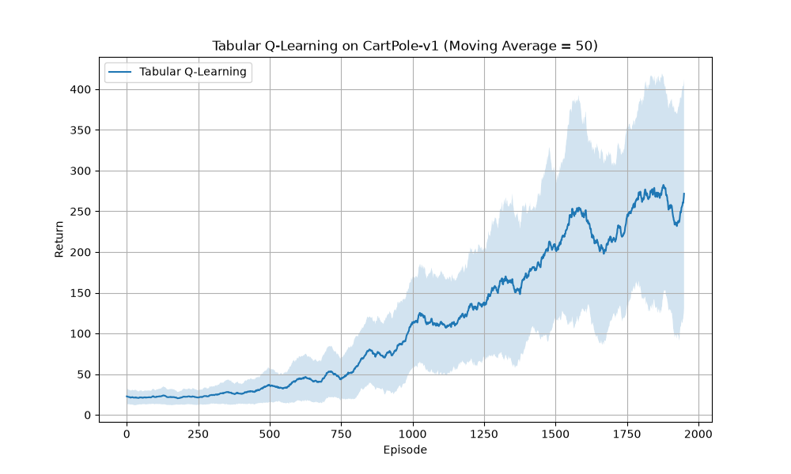
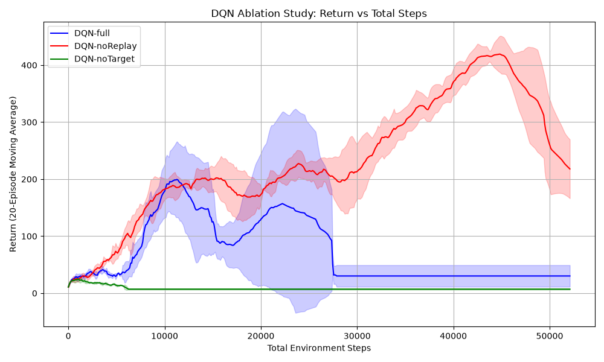
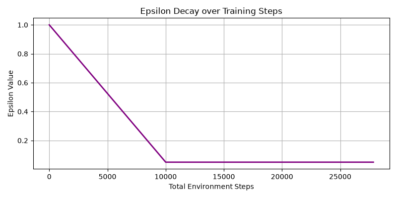
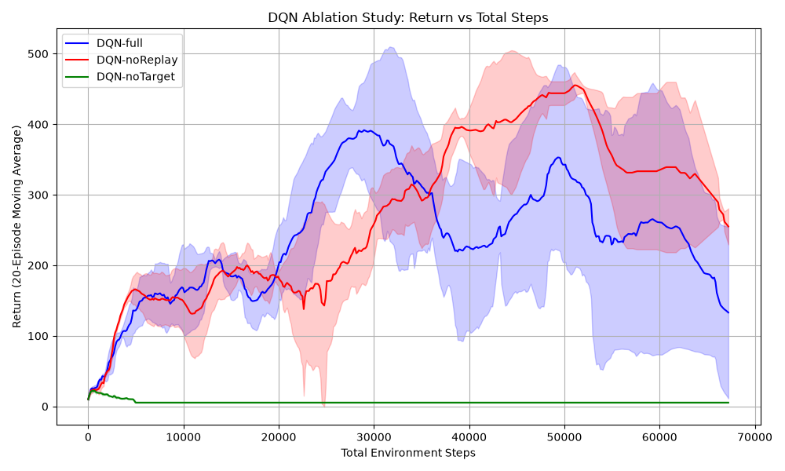
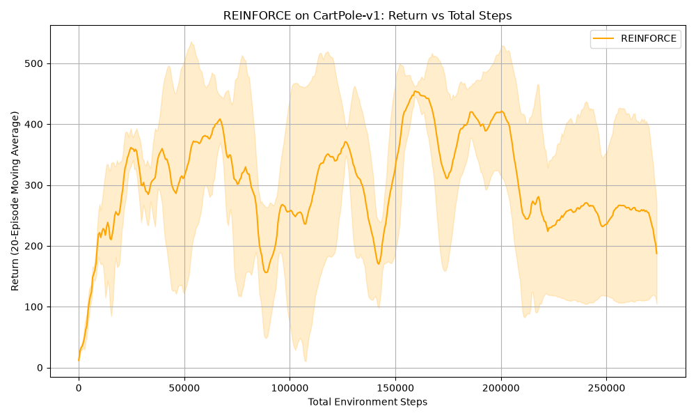
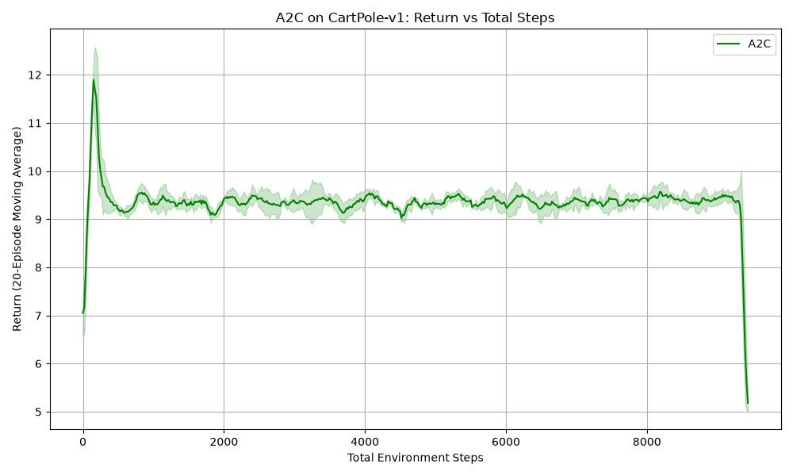
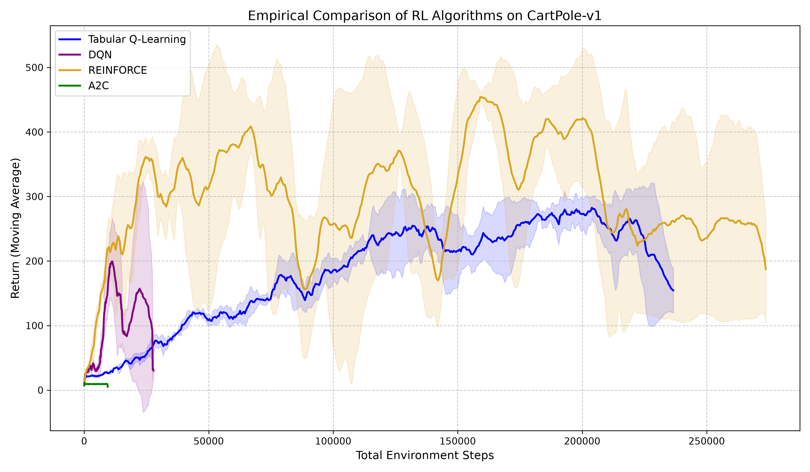
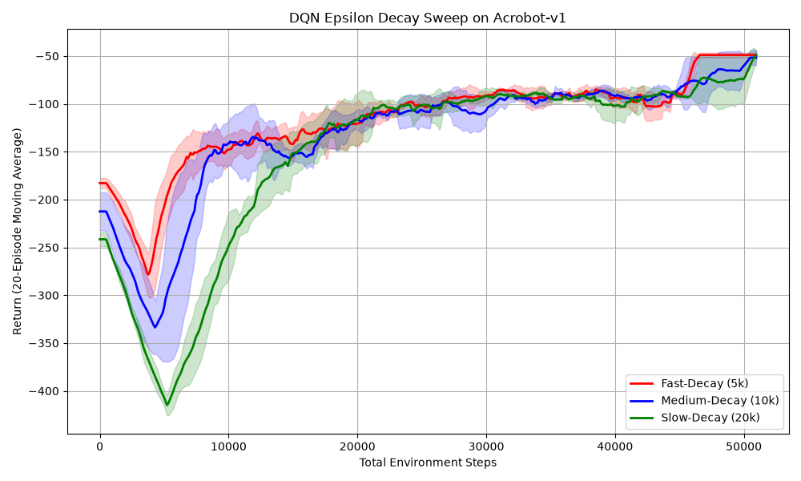

# AI HAnds-on 3rd assignemnt - Reinforcement learning

## Task 1: Tabular Q-Learning Baseline

### Instructions

The components described in the exercise relate to the following points:

- Discretise each continuous state variable into uniform bins: Because Tabular Q-learning requires a finite lookup table (the Q-table), it cannot mathematically handle continuous state spaces which contain an infinite number of possible states. By defining uniform bins, we group similar continuous values into a single discrete state index, allowing the agent to update a specific row in the table.
- Use $\epsilon$-greedy action selection with linear $\epsilon$ decay: This mechanism manages the exploration-exploitation tradeoff. The agent explores by taking a random action with probability $\epsilon$, and exploits by choosing the action with the highest known Q-value with probability $1 - \epsilon$. A linear decay gradually shifts the agent's behavior from 100% random exploration at the start of training to near-total exploitation of its learned policy at the end.

Q-Table Size: To apply tabular Q-learning to the continuous CartPole-v1 environment, the 4-dimensional state space was discretized into 6 uniform bins per variable. This results in $6^4 = 1296$ unique discrete states. Because there are 2 possible actions, the **final Q-table size** is $1296 \times 2 = 2592$ state-action pairs.

### Results

The following figure shows a graph of the return vs the episode for the Tabular Q learning algotrithm

Based on the learning curve (plotted over 2,000 episodes with a 50-episode moving average), we can break down the agent's performance into three distinct phases:

- Initial Exploration Phase (Episodes 0 – 750): The agent's return stays very low, hovering around 20 to 50. During this phase, the agent is acting mostly randomly (due to a high $\epsilon$ value) and attempting to populate its empty Q-table. Because the continuous state space was discretized into 1,296 bins, it takes hundreds of episodes just to visit enough states to start forming a meaningful baseline policy.

- Active Learning Phase (Episodes 750 – 1,600): Here, we see a clear, steady upward trajectory. The mean return climbs from 50 up to approximately 250. The agent is successfully transitioning from exploration to exploitation, utilizing the populated Q-table to keep the pole balanced for longer durations.

- Plateau and High Variance Phase (Episodes 1,600 – 2,000): The mean return begins to plateau around the 200–280 mark, occasionally dipping and rising. More importantly, the shaded confidence interval becomes extremely wide (ranging from a return of ~100 to over 400).

In general we note that the agent does not "Solve" the Environment. In CartPole-v1, solving the environment typically requires maintaining a moving average return of 475 or 500. The Tabular agent peaked at a mean of ~280, meaning it learned a good policy, but not an optimal one.T

Additionally we notice, a very high variance (the wide shaded area) in the later episodes, which highlights the core weakness of applying tabular methods to continuous physics. If the pole's angle is right on the boundary between two discrete bins, a tiny movement can shift the agent into a completely different state with a completely different Q-value. This lack of smooth generalization causes erratic behavior, explaining why the performance fluctuates so violently even late in training.

### Why Tabular Methods Do Not Scale

Tabular methods suffer heavily from the _Curse of Dimensionality_. If we wanted to increase the resolution of our discretization to 10 bins per variable to achieve finer control, the state space would grow exponentially to $10^4 = 10,000$ states. If we moved to a slightly more complex environment like LunarLander-v2 (an 8-dimensional state space) with 10 bins, the table would require $10^8$ entries. 

Because Tabular Q-learning must visit every state-action pair multiple times to converge to an optimal policy, it becomes computationally intractable—and hopelessly memory-inefficient—to train in high-dimensional continuous environments. Furthermore, tabular methods lack generalization; learning the Q-value for one bin provides absolutely no information about the neighboring bins.

## Task 2: DQN

### Instuctions

The components described in the exercise relate to the following points:
- Replay buffer (fixed-capacity circular buffer storing $(s, a, r, s′, done)$ tuples; sample random mini-batches $\ge 32$):Neural networks assume that the data they are trained on is independent and identically distributed (i.i.d.). Sequential interactions in an environment are highly correlated. The Replay Buffer breaks this correlation by storing past experiences and sampling them randomly, which prevents the network from overfitting to the immediate sequence and suffering from catastrophic forgetting.
- Target network (a frozen copy of the Q-network, hard-updated every $C$ steps):This solves the "moving target" problem. If the same network is used to calculate both the current Q-value prediction and the target Q-value, the network ends up chasing its own updates, leading to wild oscillations or divergence. Freezing the target network provides a stationary target for the loss function, stabilizing the gradient descent process.
- $\epsilon$-greedy with decay (start at $\epsilon = 1.0$, decay to $\epsilon_{min} \le 0.05$):Exactly like in Tabular Q-learning, this forces the neural network to explore the environment thoroughly before converging on a specific policy. It prevents the network from getting trapped in early, sub-optimal local minima.
- Network (at least two hidden layers with ReLU; output is one Q-value per action):The hidden layers allow the network to extract non-linear representations of the state space. By designing the output layer to yield one Q-value per discrete action, the agent can evaluate the value of all possible actions simultaneously in a single, highly efficient forward pass, rather than passing the state-action pair through the network multiple times.
- Loss (MSE or Huber loss against the TD target):The network minimizes the error between its current prediction and the Temporal Difference (TD) target:$$y_i = r_i + \gamma \cdot \max_{a'} Q_{\theta^{-}}(s'_i, a') \cdot (1 - done_i)$$Using Huber Loss (Smooth L1 Loss) is often preferred over standard MSE because it acts like MSE when the error is small but becomes linear when the error is large, preventing massive, exploding gradients when the network's early Q-value guesses are completely inaccurate.

### Results

The following figure shows a graph of three DQN variants:
1. the DQN-noTarget, the green line, with replay buffer, but not target network
2. the DQN-noReplay, the red line, with no replay buffer, but with target network
3. the DQN-full, the blue line, which has replay buffer and target network

For completeness we present the decay for $\epsilon$, which shows gow fast it deacays from 1 to 0.05.

The DQN-noTarget variant completely fails to learn and stays flat near zero.

This behaviour captures the "Moving Target" problem. Without a frozen Target Network, the agent is attempting to learn using a target 

$Y = r + \gamma \max_{a'} Q_{\theta}(s', a')$

where the parameters $\theta$ are being updated every single step.

This leads to the situation where the Q-values oscillate greatly or diverge. In this specific experiment, the lack of a stable target likely caused the Q-values to collapse or grow uncontrollably, leading to the agent never discovering a successful policy for balancing the pole. It effectively did not find a way of how to learn from the beginning.

The variant of DQN-noReplay actually shows surprisingly high returns initially, but it eventually exhibits  declining behaviour after 42000 steps. This is caused by removing the Replay Buffer. The agent is forced to learn from consecutive transitions ($s_t, s_{t+1}, s_{t+2} \dots$). These transitions are highly correlated.
However, neural networks are designed for i.i.d. (independent and identically distributed) data.

Therefore, the network starts to show overfitting to the immediate local experience. 
The line shows an initial upward trend hitting a peak, and then it starts to drop in a high decreasing rate. This is because the agent is learning only from its most recent, highly correlated experience, causing it to lose information about the strategies it learned in the past. It effectively "forgets" how to handle earlier states because it is no longer being reminded of them by the Replay Buffer.

Finally, we note the behaviour of the DQN-full bariant, with the blue line.
The model shows an inceaing trend as the DQN-noReplay variant and then it show a descreasing behaviour in results ar around 10000 steps, then it recovers at 16000 steps and then it demontstrate a sharp drop almost vertical at around 27,000 steps.

Why this might happen: In many DQN implementations on CartPole, this can happen if the network overfits to a specific "local" strategy or if the $\epsilon$-greedy exploration decayed too fast, causing the agent to get stuck in a "bad" policy that it can no longer escape.

This study shows that even with the full DQN components, reinforcement learning is highly sensitive. You could mention that this highlights the need for further tuning (e.g., using a larger replay buffer, different learning rates, or double DQN).

### some more investigation on e_decay_Steps

For a faster or slower decay we uncover different behaviours. 

Most interestingly for a fast decay `e_decay_steps=5000` (line 19 file `experiments/hyperparameter_task2/task2_experiment_dqn_e_decay_steps.py`) we get the following image, where the graph show again that the variant with NO replay has a better behaviour

However, in this case the full model overtakes the noReplay in the region of steps 20-35 thousnad but then the noReplay is becoming better after 35 thousand steps. However, both models at 50 thousand steps are degrading at the same rate.

A possible explanation for this finding is that the DQN-noReplay variant (the red line) is essentially performing online learning and because it is learning from the most recent, immediate experience, it can sometimes converge to a "good enough" policy much faster than the DQN-full version, which has to wait to sample its experiences from a large, diverse Replay Buffer.

The Replay Buffer (in DQN-full) acts as a "stabilizer" that prevents the network from overfitting. While this may be crucial for stability in complex environments (like Atari or LunarLander), in a simple, low-dimensional environment like CartPole, the Replay Buffer might actually be "slowing down" the learning by diluting the updates with older, less relevant data.

This shows that more investigation is needed to understand what is happeing in the training and highlights the need for this type of evaluations such as the ablastion study.

It will be fruitful to see this hyperparameter study in a different environment in task 4b (time permitted) 

On the other hand, with a slower decaying $\epsilon$ the DQN-noReplay variant ouperforms the DQN full variant at all steps as shown in the image below.

In all cases the variant DQN-noTarget has the worst outcome showning clearly the need for the implementation of the Target network, as the agent never understands how to start learning.

## Final thoughts on the ablaition study

From the findings on the Ablation study we confirm the necessity of the architectural components of DQN.

The DQN-noTarget variant fails completely, validating that a stable, frozen target is required to prevent the divergence of the Q-function. The DQN-noReplay variant demonstrates the danger of catastrophic forgetting; while it initially learns, the lack of sample decorrelation via a Replay Buffer prevents it from maintaining a stable policy, leading to performance degradation. 

(_Disclaimer_, note from Gemini3.5 Pro, but paper is marked in README for further investigation): These results align with the foundational findings by Mnih et al. (2015), confirming that stable learning in high-dimensional environments requires both stationary targets and uncorrelated experience sampling.

## Evaluation Metric: Environment Steps vs. Episodes

While conducting the study the question which metrics we use to compare the models in the same scale arises. 

Throughout this empirical study, algorithmic performance is plotted against **total environment steps** rather than episodes or gradient updates. An environment step is defined as a single transition ($s_t \rightarrow s_{t+1}$) experienced by the agent. Measuring against environment steps standardizes the x-axis around **sample efficiency**. 

For DQN, the relationship between environment steps and training steps is essentially 1:1.

Once the initial warmup phase is complete, DQN operates on a continuous, step-by-step interleaving process. During a single iteration of the main training loop:
- Environment Step: The agent looks at the state, chooses an action, and the environment moves forward by one frame. The agent receives the reward and next state. (+1 Environment Step)
- Storage: That single experience is pushed into the Replay Buffer.
- Training Step: The agent immediately grabs a random batch of 64 experiences from the Replay Buffer and performs gradient descent to update its neural network weights. (+1 Training Step)

Because these two actions are locked together inside the `while not done:` loop, a DQN agent that has experienced 100,000 environment steps has also performed exactly 100,000 training steps (minus the warmup buffer).

This makes DQN highly sample efficient (it learns a lot from a small amount of environment interaction) but very computationally expensive (it runs a full neural network backpropagation for every single step it takes in the game).

However, algorithms like REINFORCE only perform one network update per episode, and episodes vary wildly in length during early training, comparing algorithms by episodes or training steps would unfairly skew the learning curves.

## Task 3: Policy Gradient

### A. REINFORCE

#### Instructions

The components described in the exercise relate to the following points:

1. Policy Network: Instead of outputting Q-values, the network outputs preferences for each action, which are passed through a Softmax function. This turns them into probabilities (e.g., 70% chance to move left, 30% chance to move right).
2. Return Computation (Monte Carlo): The agent plays a full episode from start to finish before learning anything. Once the episode is over, it looks backward. For every step $t$, it calculates the exact discounted future return $G_t = \sum^{T−t−1}_{k=0} \gamma^{k}r_{t+k+1}$.
3. Return Normalization: Raw returns cause highly unstable gradients. By subtracting the mean and dividing by the standard deviation of the returns within that specific episode, we create a "baseline." Actions that performed better than average get a positive score, and actions that performed worse than average get a negative score.
4. Gradient Update: We minimize the loss $L = -E[G_t \cdot \log\pi_\theta(a_t|s_t)]$;  if an action resulted in a positive normalized return, the gradient pushes the network to increase the probability of taking that action again. If the return was negative, the network is pushed to decrease that probability.

#### Results

The following image show the graph of the returns vs the environment steps for the REINFORCE algorithm

At a first glance, we notice a volatile behaviour throughout the experiment with very high standard deviation. Also we notice that the experiment reaches up to  275000 steps.

From these observations, we may conclude that the learning curve suffers from severe instability and high variance, evidenced by the wide standard deviation bands and catastrophic performance drops at around 60, 125 and 200 thousand steps (which spikes up at around 80 and 140 thousand steps).

Furthermore, REINFORCE proves to be highly sample-inefficient compared to DQN, requiring over 250,000 environment steps to approximate convergence. This instability highlights the difficulty of relying on raw, high-variance episodic returns for gradient updates without a learned baseline or value function.

This behaviour stems from the fact that REINFORCE is a Monte Carlo method. It updates its network based on the total return of a full episode. If the agent takes 400 good steps and 1 terrible step that ends the game, it might penalize all 401 steps. This makes the gradient estimates highly noisy and creates massive variance between different training runs.

### B. Advantage Actor-Critic (A2C)

#### Instructions

The components described in the exercise relate to the following points:

1. Network: a shared MLP backbone with two heads: an actor head (policy logits) and a
critic head (scalar value). Two separate networks are also acceptable.

   Instead of two completely separate brains, the network processes the state through a shared backbone. It then branches out. The Actor outputs the action probabilities (the policy), and the Critic outputs a single number: the estimated value of being in that state

2. Advantage: one-step TD advantage: $A_t = r_t + \gamma V_w(s_{t+1}) − V_w(s_t)$.

   Instead of using the raw Monte Carlo return, we use the One-Step Temporal Difference (TD) error: $A_t = r_t + \gamma V(s_{t+1}) - V(s_t)$. This asks a very specific question: "Was taking this action in this state better than I normally expect this state to be?" If $A_t > 0$, the action was surprisingly good.

3. Actor loss: $L_{actor} = −E[A_t · \log π_{\theta}(a_t|s_t)]$

   Pushes the probabilities up for actions with a positive advantage, and down for negative ones

4. Critic loss: $L_{critic} = E[(r_t + \gamma V (s_{t+1}) − V(s_t))^2]$

   A standard Mean Squared Error loss. It trains the Critic to make its predictions $V(s_t)$ closer to the actual observed target $r_t + \gamma V(s_{t+1})$

5. Entropy bonus: add $−\beta · H(\pi(·|s_t))$ to the total loss, $\beta \in [0.001, 0.05]$.

    Neural networks can sometimes become "too sure of themselves" too early, collapsing into a suboptimal strategy (e.g., always moving right). The Entropy $H(\pi)$ measures the randomness of the policy. By subtracting it from the loss, we actively reward the network for keeping its options open, forcing exploration
6. Combined loss: $L = L_{actor} + c_v · L_{critic} − \beta · H$, with $c_v \in [0.25, 1.0]$.

- Note: Call `advantage.detach()` before computing the actor loss. Without this, gradients flow back
through the advantage into the critic weights during the actor update, producing incorrect
gradients in both heads.

  The detach() Warning: This is a crucial PyTorch detail. The Advantage $A_t$ contains the Critic's prediction $V(s)$. If you don't detach it when multiplying it by the Actor's log-probability, PyTorch will try to calculate gradients for the Actor update by tracing backward through the Critic's weights. This destroys the mathematical separation between the two heads and causes training to collapse. 

#### Results

The experiment is conducted for the following values
- learning rate: `lr = 1e-3`
- $\beta$: `entropy_beta = 0.01`
- $c_v$: `critic_coeff = 0.5` 

The following image show the graph of the returns vs the environment steps for the A2C algorithm

The image did not get any better by tweaking the configuration
- `lr=5e-4`, `entropy_beta=0.005`, `critic_coeff = 0.5`; see image `task3_a2c_fail2.png`
- `lr=5e-4`, `entropy_beta=0.005`, `critic_coeff = 0.9`; see image `task3_a2c_fail3.png`

From a first glance, we see that the agent fails to learn; the Return (moving average) is entirely flatlined between 9.0 and 9.5 and
the total training run ends abruptly just before 10,000 total steps.

From these observations we can realize that in CartPole-v1, where we get +1 reward for every step you keep the pole upright when we take a completely untrained agent that just guesses "left" or "right" randomly, the pole will fall over in about 9 to 10 steps on average. Because the score never rises above 10, the A2C agent is performing no better than random guessing for the entire training run. It never figured out how to balance the pole. If the agent is randomly dying after ~9.5 steps every single time, then 1000 episodes × 9.5 steps = 9,500 total steps. The x-axis proves that the agent exhausted all 1000 allowed episodes without ever improving its lifespan.

This may be caused by the high Gradient noise. Updating a neural network based on a single frame of data creates wildly noisy gradients. The network is essentially being yanked in completely different directions every millisecond.
The Entropy has been tweaked to lower value but this does not seem to alter the behaviour.
Another factor we can look at is the Critic network (which estimates the value) doesn't learn quickly enough in the very beginning, it feeds garbage "Advantages" to the Actor. The Actor then destroys whatever random good policy it started with

## Task 4: Comparison of all agents and Hyperparameter stydy

### A. Comparison

#### Plot all agents.

The following image show the graphs of the returns vs the environment steps for all base agents used in the performed experiments, Tabular Q learning with blue, DQN with purple, REINFORCE with yellow and A2C with green.

Comments on the results at the section _Discussion_.

#### Table: Comparison of all agents on their results

|Algorithm | Steps to solve | Final return (mean)| Std  | Wall-clock (min)|
|----------|----------------|--------------------|------|-----------------|
|Tabular Q-learning | Did not solve | 264.3      |3,45  | 0.28            | 
|DQN                | Did not solve | 105.42     |28.24 | 1.27            | 
|REINFORCE          | Did not solve | 348.3      |105.77| 3.07            |
|A2C                | Did not solve | 9.4        |0.03  | 0.48            |

_Note_: results for each model are in the files `(agent)_comparing_table.csv`

#### Discussion

The main conclusion for all models is that none of the algorithms officially "solved" the environment (which typically requires maintaining a moving average of 475+). However, their learning behaviors are vastly different.

Regarding the sample efficiency, which measures how much interaction with the environment (X-axis: Total Environment Steps) an agent needs to learn a good policy, we have the following conclusions.

- DQN was maybe the best model in this topic. Despite ultimately failing, DQN demonstrated the highest initial sample efficiency. It shot up to a return of nearly 200 in less than 15,000 environment steps. It extracts a massive amount of learning from very few steps because it reuses past experiences via its Replay Buffer.

- REINFORCE is probably the most inefficient. It took nearly 275,000 environment steps to complete its training run. Because it is a Monte Carlo method that throws away data after every episode, it requires a vast amount of environment interaction to reach its higher peak returns.

- Tabular Q-Learning is also sample-inefficient, taking roughly 235,000 steps to reach its final mean return of 264.3. Without neural networks to generalize between similar states, it has to visit almost every discrete state-action pair manually to learn.

- The A2C is "out of the competition". The configuration of A2C suffered a catastrophic initialization failure (flatlining at a random-guessing score of 9.4), hence we cannot accurately judge its sample efficiency from this run.

Regarding the training Stability, which looks at the variance between different random seeds (the shaded areas) and whether the agent suffers from "catastrophic forgetting" (violent drops in performance), we draw the following conlcusions.

- Tabular Q-Learning is the most stable algorithm that actually learned. As seen in the graph, it has a highly consistent, steady, and near-linear upward trajectory. The table confirms this with a remarkably low final standard deviation (Std: 3.45).

- On the other hand, REINFORCE is extremely unstable. The graph shows a massive shaded area, indicating that different seeds resulted in wildly different policies. Furthermore, the mean line oscillates violently, crashing from around 450 down to around 150 repeatedly. The table reflects this extreme variance with a final Std of 105.77.

- The DQN wlgorithm show an initial stable behaviour, but it suffers from forgetting leading to a abrupt decline. Around 20,000 steps, the policy completely collapsed, dropping from ~200 down to a final mean return of 105.42 (Std: 28.24).

- Finally, A2C may show a Std of 0.03, but this is a false positive for stability. The agent was perfectly stable at "failing", repeatedly letting the pole fall over after exactly 9.4 steps.

Finally regarding the Wall-Clock Speed which measures the computational overhead (how long the algorithm took to run in the machine)

- Tabular Q-Learning is the Fastest with 0.28 min: Tabular Q-learning is incredibly fast computationally. It uses simple dictionary/array lookups and basic arithmetic to update Q-values. Because it has no neural networks, no backpropagation, and no tensor operations, it finishes in a fraction of a minute. However it does not scale.

- The worst candidate is A2C which may be fast with 0.48 min, but this is an artifact of its failure. Because the agent dies every 9.4 steps, the 1,000 episodes finished very fast. If it had survived for 500 steps per episode, this wall-clock time would be higher.

- DQN is Moderate fast. DQN is computationally heavy as it performs a neural network backpropagation and samples from a Replay Buffer at every single environment step. However, because its agent died quickly after policy collapse, it didn't accumulate as many total steps, keeping the time relatively low.

- Finally, REINFORCE is the slowest with a run of 3.07 min in these experiments. REINFORCE took the longest because the agent learned to survive for hundreds of steps per episode (accumulating 275,000 total steps), the CPU had to perform hundreds of thousands of neural network forward passes, significantly driving up the computation time.

### B. Hyperparameter Study

For this experiment, we will switch the environment to Acrobot-v1, as it is a classic control task where you control a two-link pendulum (like a gymnast on a high bar). 

You only apply torque to the middle joint. It is a harder exploration problem than CartPole because the agent only gets a "success" signal when the tip of the lower link swings up to a certain height.

We investigate the Exploration-Exploitation Tradeoff in standard DQN. we use an $\epsilon$-greedy policy to manage how the agent discovers the world.
- Explore (Random Action): Helps the agent discover new states and potentially higher rewards.
- Exploit (Greedy Action): Uses the current Q-network to maximize immediate known reward.

The rate at which we decay $\epsilon$ from $1.0$ (pure exploration) to $0.05$ (heavy exploitation) dictates the agent's learning trajectory

By setting a fast Decay (e.g., 5,000 steps) the agent stops exploring very early. The risk is that it might find a mediocre strategy (local optimum) and exploit it forever, never realizing a much better strategy exists. In Acrobot, it might just learn to violently twitch at the bottom and never swing up.

On the other hand, by setting a Slow Decay (e.g., 20,000 steps) the agent explores for a massive portion of training. This might lead to to a highly sample-inefficient behaciour. Even if the neural network has already learned the optimal path, the agent keeps taking random actions, artificially depressing its training score and wasting time.

#### Results

The following image show the graphs of the returns vs the environment steps for the DQN full variant for three different decaying parameters Fast decay for 5 thousand steps (red), Moderate decay for 10 thousand steps (red) and Slow decay for 20 thousand steps (green)

To evaluate the sensitivity of the Deep Q-Network's exploration-exploitation tradeoff, three different $\epsilon$-decay schedules are tested on the Acrobot-v1 environment: Fast-Decay (5,000 steps), Medium-Decay (10,000 steps), and Slow-Decay (20,000 steps). 

Note that the variable $\epsilon$ is set to linearly decay from $1.0$ down to $0.05$.

For all three values we obser an Initial Learning Dip. All three configurations exhibit a sharp drop in performance during the first 5,000 steps. This is a common phenomenon in DQN; as the neural network begins updating its initially random weights, its early Q-value estimates are highly inaccurate, temporarily causing the agent to perform worse than pure random guessing (dropping toward the -500 step limit).

Regarding the convergence we notice that by the 50,000-step mark, all three configurations successfully converge to a near-optimal policy, achieving a moving average return of roughly $-50$.

 The defining difference between the configurations is the speed of recovery and the sample efficient. The Fast-Decay (red line) recovers from the initial dip the fastest and reaches the convergence plateau of $-100$ by step 15,000.
 
 The Slow-Decay (green line) suffers the deepest performance drop (down to nearly $-425$) and takes roughly 25,000 steps to reach the same plateau.
 
Based on the empirical data, the Fast-Decay (5,000 steps) schedule is the best performing hyperparameter configuration for this specific task and proved superior because it maximized sample efficiency. While Acrobot-v1 requires the agent to discover a specific sequence of movements to swing the lower link upward, the physics of the environment are entirely deterministic, and the state space is relatively low-dimensional (6 variables). 

The data proves that 5,000 steps of pure, unconstrained exploration were perfectly sufficient to populate the Replay Buffer with enough successful "swing-up" transitions. Once that data was in the buffer, transitioning rapidly to exploitation ($\epsilon \le 0.05$) allowed the network to immediately begin optimizing the policy.Conversely, the Medium and Slow decay schedules penalized the agent. Even though the underlying Q-network likely learned the correct physics just as quickly, the artificially high $\epsilon$ value forced the agent to continue taking sub-optimal, random actions for an additional 5,000 to 15,000 steps. This over-exploration actively delayed the onset of the optimal policy, resulting in the deeper performance dips and delayed convergence observed in the blue and green curves.

Finally, we note the wall-clock for the three runs and we note that by increasing the $\epsilon$ decay schedule the running also increases.
- DQN Fast-Decay (5k) took 2.81 mins
- DQN Medium-Decay (10k) took 3.06 mins
- DQN Slow-Decay (20k) took 3.13 mins

So not only the fastest schedule presents the best results but is actually the fastest in calculations as well.